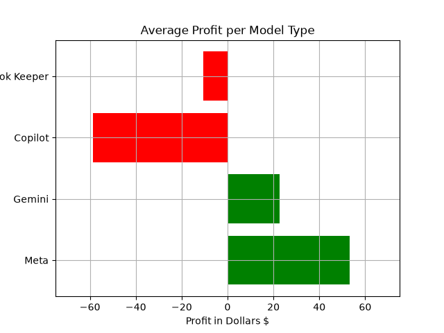
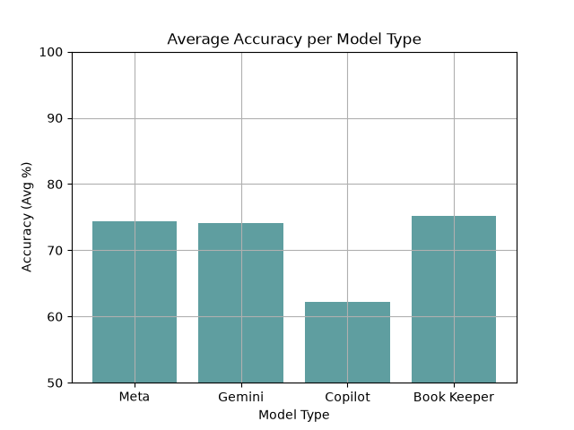

# Project: Can Large Language Models be effective for predicting NBA games?
Comparing the performance of llama 3 (Meta AI), GPT-4 (Copilot) and Gemini Flash 2.0 with regards to NBA moneyline sportsbetting. Originally created as a research project while attending Eastern Connecticut State University.

## Key Findings
Meta Ai and Gemini Flash 2.0 were significantly profitable, while copilot struggled to generate profit. Genimi and meta also proved to have accuracy on par with the book keeper.

## Skills Demonstrated

- Data processing & analysis with pandas
- Data visualization with matplotlib
- Comparative evaluation methodology across multiple LLMs
- Technical writing / research documentation

## Running it
Create a virtual environment using python 3.11 and the requirements.txt file
Run Create_Graphs.py either as a python script or in a supported IDE. I reccomend VS Code!

## Limitations and Future Improvements
- Dataset was limited to only 115 games, a larger dataset would improve the reliability of results
- Prompting was done manually and inefficiently, an automated system using a python script and APIs would be much much more efficient and of more value
- only compared 3 LLMs, worth testing with newer models as an entire year and a half has passed
- Only wins were measured, win differential could be interesting to look at as well
